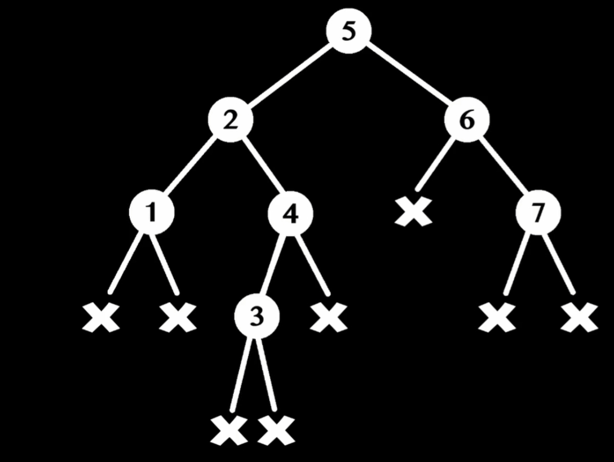

## 二元樹

實際二元樹樹，會是包含null如下圖

## 遍歷Traversal方式

1. DFS Left  左邊先走
2. DFS Right 右邊先走

-----

## DFS Left 

#### Pre-Order 立馬印出來!
5、2、1、4、3、6、7

#### In-Order 單方向深入完 再印出來!
1、2、3、4、5、6、7

#### Post-Order 雙方向深入完 再印出來!
1、3、4、2、7、6、5

-----

## DFS Right 

#### Pre-Order 立馬印出來!
5、6、7、2、4、3、1

#### In-Order 單方向深入完 再印出來!
7、6、5、4、3、2、1

#### Post-Order 雙方向深入完 再印出來!
7、6、3、4、1、2、5

---

## BST Binary Search Tree
大部分 DFS Left實作

Left Child Node < Self Node < Right Child Node